# LSD Architecture Documentation

> **For new contributors** — LSD is a branded, extended fork of the `pi` coding agent. The core agent engine lives in the `packages/` workspace. Everything in `src/` is the LSD layer that wraps, brands, and extends that core.
>
> **Quick start?** Read [LEARNING.md](../LEARNING.md) for a developer onboarding guide.

---

## Table of Contents

1. [Big Picture](#big-picture)
2. [Repository Layout](#repository-layout)
3. [Source File Reference](#source-file-reference)
4. [Startup Flow](#startup-flow)
5. [Package Architecture (Core Engine)](#package-architecture-core-engine)
6. [Extension System](#extension-system)
7. [Session & Memory System](#session--memory-system)
8. [Operating Modes](#operating-modes)
9. [Configuration & Preferences](#configuration--preferences)
10. [Worktrees (Isolated Workspaces)](#worktrees-isolated-workspaces)
11. [Key Data Flows](#key-data-flows)

---

## Big Picture

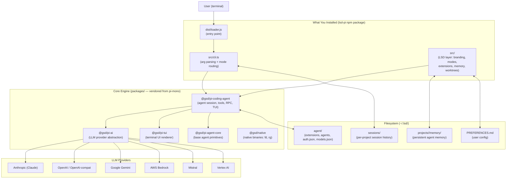

---

## Repository Layout

```
lsd/
├── src/                        # LSD layer (TypeScript source)
│   ├── loader.ts               # Entry point: env setup, workspace linking, boots cli.ts
│   ├── cli.ts                  # Main CLI: arg parsing, mode routing, session init
│   ├── headless.ts             # Headless/auto mode orchestrator (spawns RPC child)
│   ├── onboarding.ts           # First-run setup wizard
│   ├── resource-loader.ts      # Syncs bundled resources to ~/.lsd/agent/
│   ├── extension-discovery.ts  # Scans directories for extension entry points
│   ├── extension-registry.ts   # Extension manifest types, enable/disable state
│   ├── app-paths.ts            # ~/.lsd path constants (appRoot, agentDir, sessionsDir)
│   ├── shared-paths.ts         # Walks up to find .lsd/ project root
│   ├── shared-preferences.ts   # PREFERENCES.md YAML parser + merge logic
│   ├── worktree-cli.ts         # Git worktree subcommand + -w flag
│   ├── welcome-screen.ts       # Branded welcome banner
│   ├── mcp-server.ts           # --mode mcp MCP server entry
│   ├── cli-theme.ts            # Accent color helpers
│   ├── lsd-brand.ts            # Brand color constants
│   ├── rtk.ts                  # RTK shell command compression bootstrap
│   ├── tool-bootstrap.ts       # fd/rg managed binary setup
│   ├── models-resolver.ts      # models.json path (LSD → pi fallback)
│   ├── tests/                  # Unit and integration tests
│   └── resources/
│       ├── extensions/         # ~25 bundled extensions (synced to ~/.lsd/agent/extensions/)
│       │   ├── memory/         # Persistent memory system
│       │   ├── browser-tools/  # Playwright browser automation
│       │   ├── subagent/       # Background subagent system
│       │   ├── claude-code-cli/# Claude provider via Anthropic SDK
│       │   ├── codex-rotate/   # Multi-account OAuth rotation
│       │   ├── remote-questions/# Slack/Discord/Telegram question routing
│       │   ├── bg-shell/       # Background shell process management
│       │   ├── search-the-web/ # Brave/Tavily/Jina web search
│       │   ├── mac-tools/      # macOS native UI automation
│       │   └── ...             # context7, google-search, usage, voice, etc.
│       └── skills/             # Bundled skills (review, test, lint, etc.)
│
├── packages/                   # Core engine workspace packages (vendored from pi-mono)
│   ├── pi-coding-agent/        # Agent session, built-in tools, RPC, TUI shell
│   ├── pi-ai/                  # LLM provider abstraction layer
│   ├── pi-tui/                 # Terminal UI renderer
│   ├── pi-agent-core/          # Base agent primitives
│   ├── native/                 # Native binaries (fd, rg wrappers)
│   ├── rpc-client/             # JSON-RPC client for headless mode
│   ├── mcp-server/             # MCP server implementation
│   └── daemon/                 # Background daemon process
│
├── dist/                       # Compiled output (TypeScript → JS)
│   ├── loader.js               # Compiled loader (npm bin entry)
│   ├── cli.js                  # Compiled CLI
│   └── resources/              # Copied extension + agent + skill resources
│
├── pkg/                        # Shim: piConfig + theme assets (no src/)
│                               # Lets pi read LSD branding without its own entry point
├── docs/                       # User-facing documentation
├── scripts/                    # Build, release, postinstall helpers
├── LEARNING.md                 # Developer onboarding guide
├── CONTRIBUTING.md             # Contribution guidelines
└── VISION.md                   # Project philosophy
```

---

## Source File Reference

Every file in `src/` with its responsibility:

| File | Purpose |
|------|---------|
| `loader.ts` | Entry point. Fast-path `--version`/`--help`, env setup, workspace linking, boots `cli.ts` |
| `cli.ts` | Main CLI. Arg parsing, mode routing (TUI/headless/print/RPC/MCP), session init |
| `headless.ts` | Headless orchestrator. Spawns RPC child, auto-responds to UI, streams progress |
| `headless-events.ts` | Event classification (terminal signals, blocked/cancelled detection, exit codes) |
| `headless-types.ts` | Type definitions for headless output formats (`HeadlessJsonResult`, `OutputFormat`) |
| `headless-ui.ts` | Progress formatting for headless stderr (tool calls, thinking, text streaming) |
| `headless-answers.ts` | Pre-supplied answer injection for headless (answer file parsing + auto-response) |
| `headless-context.ts` | Context loading for headless (`--context` file/stdin + project bootstrapping) |
| `app-paths.ts` | Path constants: `appRoot` (`~/.lsd`), `agentDir`, `sessionsDir`, `authFilePath` |
| `shared-paths.ts` | Walks up from cwd to find `.lsd/` or `.gsd/` project state root |
| `shared-preferences.ts` | PREFERENCES.md YAML frontmatter parser (global + project merge) |
| `project-sessions.ts` | Per-directory session path encoding (cwd → safe filesystem path) |
| `extension-discovery.ts` | Scans directories for extension entry points (package.json → index.ts/js fallback) |
| `extension-registry.ts` | Extension manifest types, registry persistence, enable/disable state |
| `resource-loader.ts` | Syncs bundled resources to `~/.lsd/agent/`, builds `DefaultResourceLoader` |
| `models-resolver.ts` | Resolves `models.json` path (LSD → pi fallback for migration) |
| `onboarding.ts` | First-run setup wizard (LLM provider auth, tool keys, search provider) |
| `onboarding-llm.ts` | LLM provider options and budget model configuration for onboarding |
| `welcome-screen.ts` | Branded two-panel welcome banner shown on interactive session start |
| `worktree-cli.ts` | Git worktree subcommands (list, merge, clean, remove) and `-w` flag |
| `worktree-name-gen.ts` | Generates random adjective-noun worktree names |
| `rtk.ts` | RTK shell command compression bootstrap (download, install, PATH setup) |
| `tool-bootstrap.ts` | Ensures `fd` and `rg` managed binaries are available in `~/.lsd/agent/bin/` |
| `mcp-server.ts` | MCP server entry (`--mode mcp`), exposes LSD tools to external AI clients |
| `cli-theme.ts` | Accent color helpers, reads from active theme for CLI output |
| `lsd-brand.ts` | Brand color constants (yellow/blue/pink) and ANSI rendering helpers |
| `logo.ts` | ASCII art logo rendering |
| `help-text.ts` | `--help` output and subcommand help text |
| `startup-timings.ts` | Lightweight perf timing utility (opt-in via `GSD_STARTUP_TIMING=1`) |
| `startup-model-validation.ts` | Validates configured model exists after extensions register their models |
| `pi-migration.ts` | Migrates credentials from `~/.pi/` to `~/.lsd/` on first run |
| `update-check.ts` | Non-blocking update check with cached result |
| `update-cmd.ts` | `lsd update` command — runs `npm install -g lsd-pi@latest` |
| `wizard.ts` | Shared wizard utilities (env key loading, provider detection) |
| `codex-rotate-settings.ts` | Checks if Codex multi-account rotation is enabled |
| `bedrock-auth.ts` | AWS Bedrock credential storage and validation |
| `bundled-extension-paths.ts` | Serializes/deserializes extension paths for env var passing |
| `bundled-resource-path.ts` | Resolves bundled resource file paths from package root |

### Bundled Extensions (`src/resources/extensions/`)

| Extension | Purpose |
|-----------|---------|
| `memory/` | Persistent memory system (MEMORY.md index, auto-extract, dream consolidation) |
| `browser-tools/` | Full Playwright browser automation (screenshots, forms, assertions, navigation) |
| `subagent/` | Background subagent system (scout, worker, parallel/chain execution) |
| `claude-code-cli/` | Claude provider via Anthropic SDK (streaming, partial builder) |
| `codex-rotate/` | Multi-account ChatGPT/Codex OAuth rotation (round-robin, auto-refresh) |
| `remote-questions/` | Relay agent questions to Telegram, Discord, or Slack |
| `bg-shell/` | Background shell process management (persistent sessions, readiness detection) |
| `search-the-web/` | Web search (Brave, Tavily, native) + page fetch (Jina) |
| `context7/` | Context7 library documentation lookup |
| `mac-tools/` | macOS native UI automation via Accessibility APIs |
| `usage/` | Token usage tracking and reporting (`/usage` command) |
| `usage-tips/` | Contextual usage tips and cost-saving suggestions |
| `voice/` | Voice input (macOS Swift, Linux Groq) |
| `async-jobs/` | Async bash execution with job management |
| `cache-timer/` | Prompt cache countdown display in footer |
| `ttsr/` | Tool-to-system-prompt rules engine |
| `mcp-client/` | MCP server client integration |
| `universal-config/` | Discovers config files from other AI tools (Claude, Cursor, etc.) |
| `cmux/` | Terminal multiplexer integration |
| `slash-commands/` | Built-in slash commands (audit, plan, clear, context, tools) |
| `google-search/` | Google-backed web search via Gemini |
| `shared/` | Shared utilities (UI helpers, formatters, preference readers, tests) |

---

## Startup Flow

Every `lsd` invocation starts at `dist/loader.js` and follows this path:

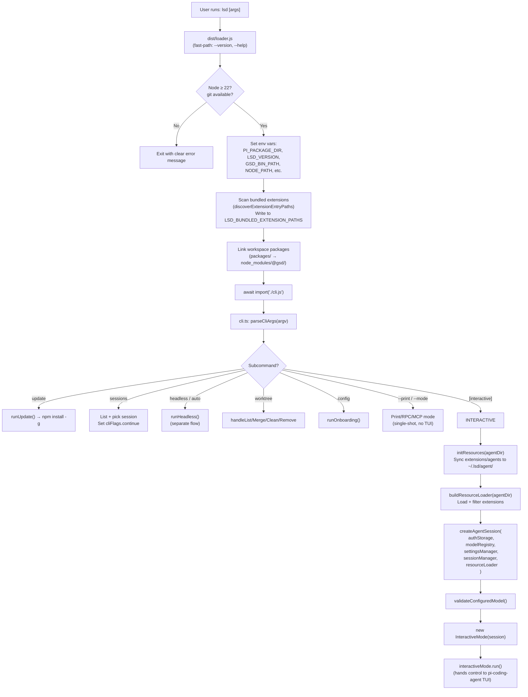

---

## Package Architecture (Core Engine)

The `packages/` directory contains the vendored core — you rarely need to touch these unless fixing a core bug.

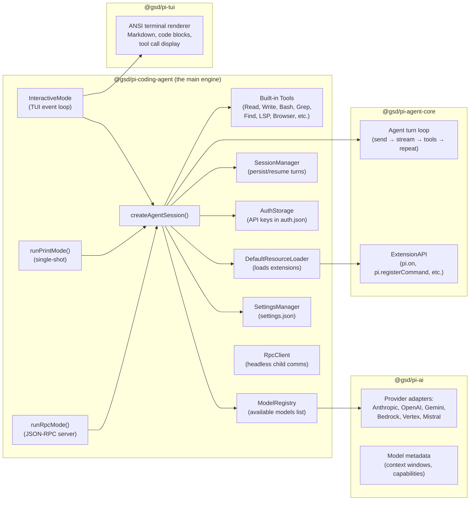

---

## Extension System

Extensions are TypeScript/JavaScript modules that hook into the agent lifecycle. They are the primary way LSD adds features on top of the core engine.

### How extensions are discovered and loaded

```mermaid
flowchart LR
    subgraph "Source: src/resources/extensions/"
        BUNDLED["Bundled extensions\n(memory, browser-tools,\nmac-tools, context7, etc.)"]
    end

    subgraph "Sync to ~/.lsd/agent/extensions/"
        SYNCED["initResources() copies\nsrc/resources/ → ~/.lsd/agent/\non every launch if version changed"]
    end

    subgraph "Discovery"
        DISCOVER["discoverExtensionEntryPaths(dir)\n1. Top-level .ts/.js → entry\n2. Subdirs: check package.json pi.extensions\n   or fall back to index.ts/index.js"]
        REGISTRY["loadRegistry()\n~/.lsd/extensions/registry.json\nstores enabled/disabled state"]
        FILTER["Filter by:\n- registry.entries[id].enabled\n- manifest.defaultEnabled\n- Special gates (codexRotateEnabled)"]
    end

    subgraph "Loading"
        RESLOADER2["DefaultResourceLoader.reload()\nCompiles extensions via jiti\n(TypeScript → runtime, no build step)"]
        EXTAPI2["ExtensionAPI injected\ninto each extension's\ndefault export function"]
    end

    BUNDLED --> SYNCED --> DISCOVER
    DISCOVER --> REGISTRY --> FILTER --> RESLOADER2 --> EXTAPI2
```

### Extension anatomy

Every extension is a TypeScript file that exports a default function:

```typescript
// src/resources/extensions/my-extension/index.ts
import type { ExtensionAPI } from '@gsd/pi-coding-agent'

export default function myExtension(pi: ExtensionAPI) {
  // Hook into lifecycle events
  pi.on('session_start', async (event, ctx) => { /* ... */ })
  pi.on('before_agent_start', async (event) => {
    // Can modify the system prompt
    return { systemPrompt: event.systemPrompt + '\nExtra instructions...' }
  })
  pi.on('turn_end', async (event, ctx) => { /* ... */ })
  pi.on('tool_call', async (event, ctx) => {
    // Can block tool calls
    return { block: true, reason: 'Not allowed' }
  })

  // Register slash commands
  pi.registerCommand('my-command', {
    description: 'Does something useful',
    handler: async (args, ctx) => {
      pi.sendUserMessage('Hello from my extension!')
    }
  })

  // Register custom tools the LLM can call
  pi.registerTool({ name: 'my_tool', description: '...', schema: {}, handler: async (input) => { /* ... */ } })

  // Send UI messages
  pi.sendMessage({ customType: 'my:event', content: 'text', display: true })
}
```

### Extension manifest (optional)

```json
// extension-manifest.json
{
  "id": "my-extension",
  "name": "My Extension",
  "version": "1.0.0",
  "description": "Does cool things",
  "tier": "bundled",      // "core" (cannot disable) | "bundled" | "community"
  "requires": { "platform": "*" },
  "provides": {
    "tools": ["my_tool"],
    "commands": ["my-command"]
  },
  "defaultEnabled": true
}
```

### Lifecycle event order

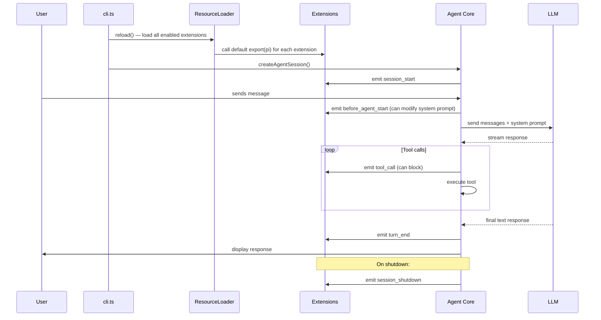

---

## Session & Memory System

### Sessions

Sessions persist the full conversation history so you can resume where you left off.

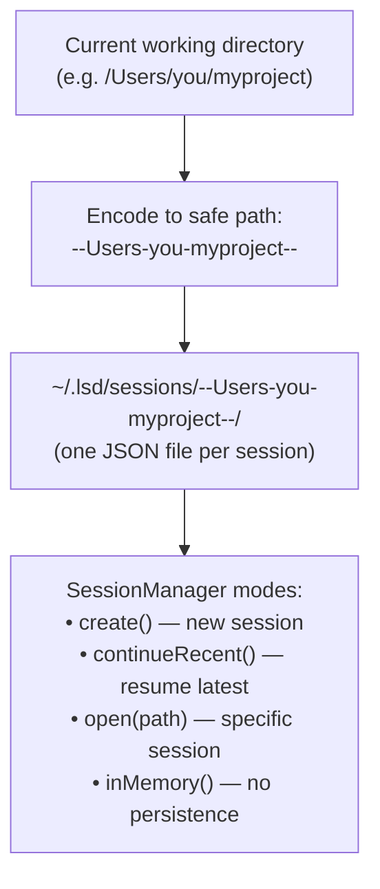

**CLI flags for session control:**
- `lsd` — creates a new session
- `lsd -c` / `lsd --continue` — resumes the most recent session for this directory
- `lsd sessions` — interactive session picker

### Memory System

The memory extension gives the agent persistent memory across sessions, stored as plain Markdown files.

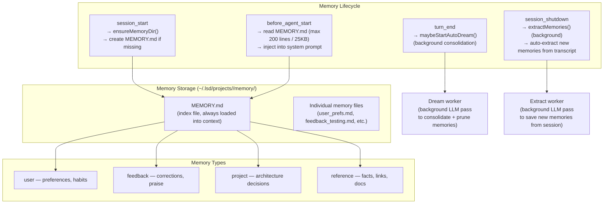

**Memory frontmatter format:**
```markdown
---
name: User prefers tabs
description: User explicitly stated tab indent preference in TypeScript
type: user
---

User prefers tabs (not spaces) in TypeScript files.
**Why:** Stated directly: "always use tabs".
**How to apply:** Set tab indentation when writing or editing TypeScript.
```

---

## Operating Modes

LSD has four distinct operating modes depending on how it's invoked:

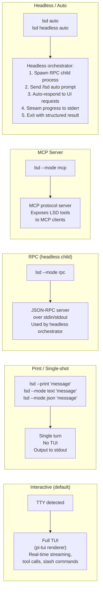

### Headless mode deep-dive

The headless mode is how CI/CD and programmatic use works. It's a two-process architecture:

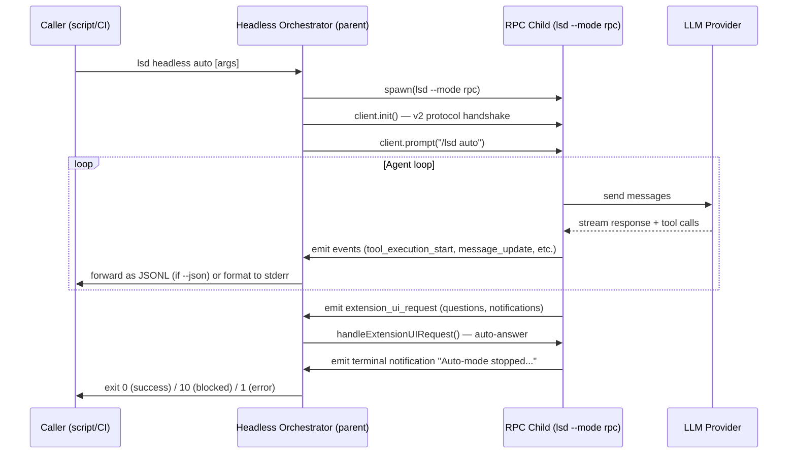

---

## Configuration & Preferences

### Config file hierarchy

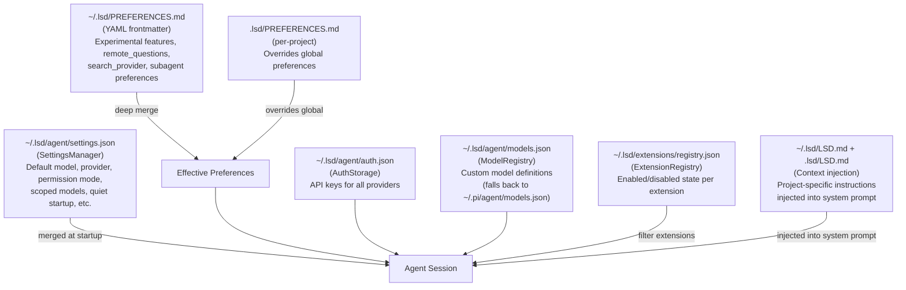

### Environment variables

| Variable | Purpose |
|---|---|
| `LSD_HOME` / `GSD_HOME` | Override `~/.lsd` base directory |
| `LSD_VERSION` / `GSD_VERSION` | Current version string |
| `LSD_BIN_PATH` / `GSD_BIN_PATH` | Path to the `lsd` binary (for child processes) |
| `PI_PACKAGE_DIR` | Points pi's config resolver to `pkg/` (LSD branding) |
| `PI_NO_SANDBOX` | Disable sandbox |
| `PI_SANDBOX` | Set sandbox level (`none`, `workspace-write`, `auto`) |
| `GSD_HEADLESS` | Tell extensions we're in headless mode |
| `LSD_BUNDLED_EXTENSION_PATHS` | Serialized list of extension entry paths |
| `GSD_RTK_DISABLED` | Disable RTK shell command compression |
| `NODE_COMPILE_CACHE` | V8 bytecode cache dir (Node 22+) |

---

## Worktrees (Isolated Workspaces)

Worktrees let you run the agent on an isolated git branch without affecting your main working tree.

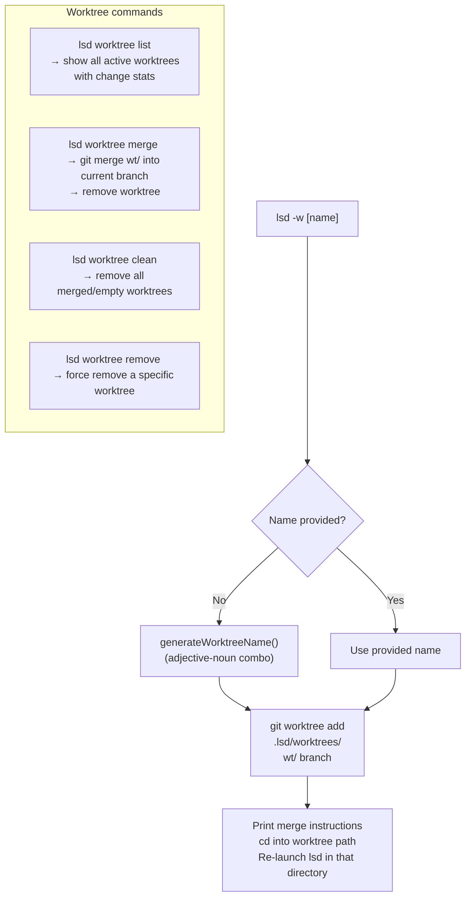

**Worktree storage:** `.lsd/worktrees/<name>/` (inside the project's `.lsd/` state directory)

---

## Key Data Flows

### How a user message becomes an LLM response

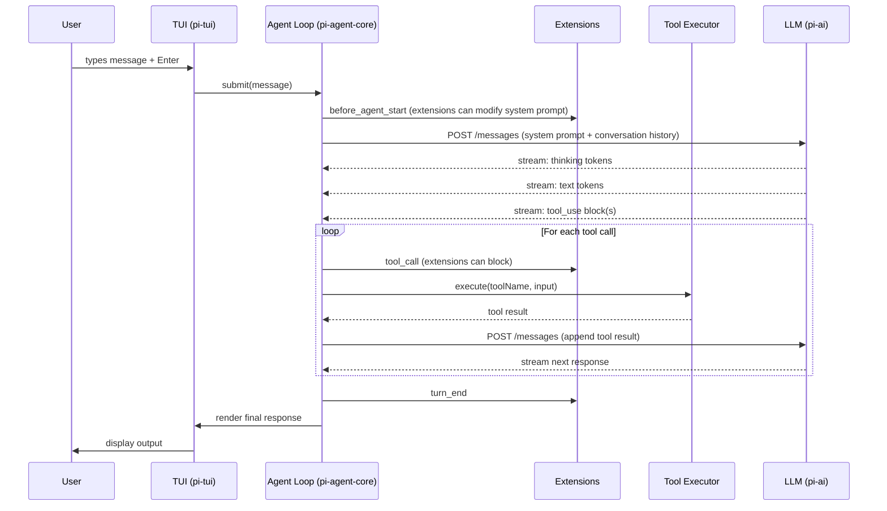

### How extensions are linked to the agent session

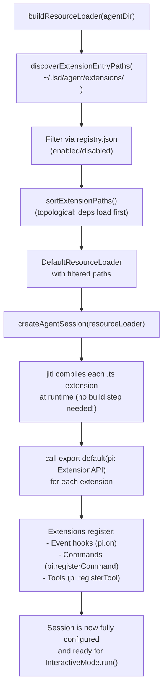

### Auth and model resolution

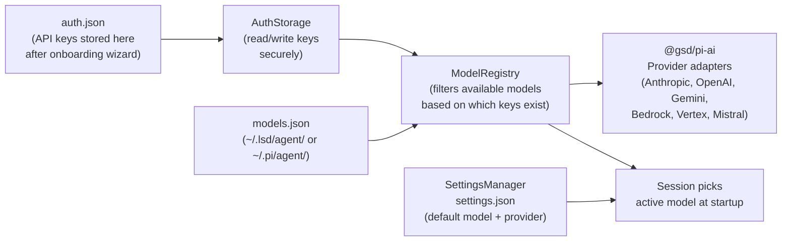

---

## Glossary

| Term | Meaning |
|---|---|
| **pi** | The upstream open-source coding agent that LSD is forked from |
| **pi-coding-agent** | The core workspace package (`@gsd/pi-coding-agent`) — session, tools, TUI |
| **pi-ai** | The LLM abstraction layer (`@gsd/pi-ai`) — handles all provider APIs |
| **Extension** | A TypeScript module in `resources/extensions/` that hooks into the agent lifecycle |
| **ResourceLoader** | The class that discovers, compiles (via jiti), and loads extensions |
| **Session** | A persistent conversation thread, stored in `~/.lsd/sessions/` |
| **agentDir** | `~/.lsd/agent/` — where extensions, auth, models, and binaries live |
| **appRoot** | `~/.lsd/` — top-level LSD data directory |
| **Headless mode** | Running without a TUI; parent process spawns an RPC child and communicates via JSON-RPC |
| **RPC child** | `lsd --mode rpc` — a silent agent subprocess that receives prompts and emits events over stdin/stdout |
| **RTK** | Shell command compression tool (optional, opt-in) |
| **jiti** | TypeScript runtime compiler — allows extensions to be loaded as `.ts` without a build step |
| **Worktree** | An isolated git working tree (`git worktree`) for running the agent on a separate branch |
| **Dream** | Background memory consolidation pass — the agent reviews and prunes its own memory files |
| **PREFERENCES.md** | User config file (YAML frontmatter) for experimental features and provider settings |
| **registry.json** | `~/.lsd/extensions/registry.json` — tracks which extensions are enabled or disabled |
